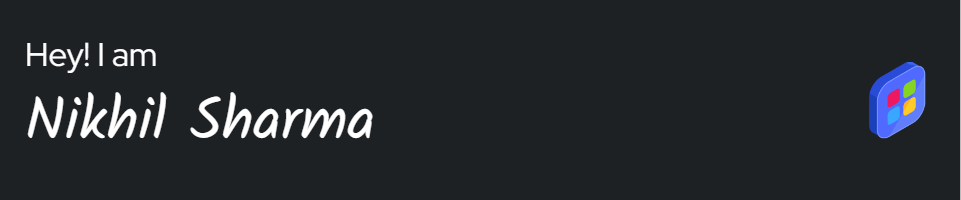

<header>
  

<!--
**nikhilsharma270027/nikhilsharma270027** is a ✨ _special_ ✨ repository because its `README.md` (this file) appears on your GitHub profile.

Here are some ideas to get you started: -->

- 🌱 I’m currently learning Django
- 🔭 I’m currently working on Nextjs and Python

  <table align="left">
  <tr >
    <th>
      
      <a href="https://nikhil-sharma-portfolio.vercel.app/" />  My Portfolio  
    </th> 
    <th>
      
  <a href="https://www.linkedin.com/in/nikhil-sharma-496680279/" />   LinkedIn
    </th> 
        
     <th>
       
        <a href="https://leetcode.com/u/nikhilsharmaa/">LeetCode</a>
    </th>
     <th>
       
      <a href="https://x.com/NSharmaDev27" />   𝕏 (Twitter)
    </th> 
  </tr>
  
</table>
</header>
 
 

# 💻 Tech Stack:
 
 
 
 
 

# 📊 GitHub Stats:

  
 
 

&nbsp;

  
  

